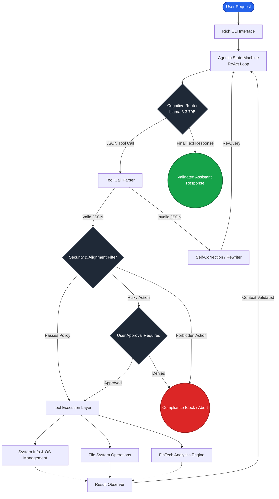

# Intelligent Windows Automation Agent

This is a 3-week FinTech project assignment to build an Intelligent Windows Automation Agent. It leverages a Large Language Model (via Groq API) to control the Windows operating system through natural language, acting as a smart FinTech assistant.

## Features

- **Natural Language OS Control**: Ask the agent to open applications, close them, manage files, or get system metrics.
- **FinTech Scenario (Personal Finance Agent)**: Monitor spending categories, generate CSV files, summarize transactions, and alert budget overruns.
- **ReAct Loop**: Uses Reason-Act-Observe loops with LLM tool calling. Maximum 10 iterations to prevent infinite loops.
- **Robust Security Layer**: 
  - Blocked destructive commands (`format`, `del /f`, etc.)
  - Application Whitelist ensuring only safe programs are launched
  - Requires user approval for potentially destructive actions (e.g., shell commands)
  - Detailed audit log written to `logs/agent.log`
- **Fault Tolerance & API Resiliency**:
  - Automatically retries network/API failures with backoff wait times.
  - LLM self-correction loop catches invalid JSON tool arguments and instructs the model to retry automatically.

## Prerequisites

- Python 3.10+
- Git
- Windows 10 / 11

## Setup Instructions

1. **Clone the repository:**
   ```powershell
   git clone https://github.com/khelanaramadhan-max/WINDOWS-AI-AGENT-SYSTEM.git
   cd "WINDOWS AI AGENT SYSTEM"
   ```

2. **Set up a Virtual Environment & Install Dependencies:**
   ```powershell
   python -m venv venv
   .\venv\Scripts\activate
   pip install -r requirements.txt
   ```

3. **Configure Environment Variables:**
   - Rename `.env.example` to `.env`.
   - Update the `.env` file with your Groq API Key:
     ```
     GROQ_API_KEY=your_groq_api_key_here
     ```

## Usage

Start the agent loop:
```powershell
.\venv\Scripts\python agent.py
```

### Example Commands:
- "What is my current RAM and CPU usage?"
- "List the top running processes."
- "Create a sample transactions CSV."
- "Check my spending from the transactions CSV and summarize it."
- "Are there any budget overruns in the transactions CSV?"
- "Open notepad"

## AI Assistance
This project was developed with the assistance of DeepMind Antigravity, which generated the boilerplate structure, core Python logic, tool integrations, and README.

## Architecture & Process Pipeline

The intelligence agent operates via a self-correcting state machine (ReAct loop). The underlying processing pipeline follows the architecture flow below:



### Core Components
- **`agent.py`**: The central orchestrator running the Rich CLI loop and interacting with the Groq API.
- **`tools.py`**: OS-level tools like process management and system info.
- **`fintech.py`**: Business logic and text-based analytics for the Personal Finance scenario.
- **`security.py`**: Security guardrails, validation routing, and audit logging.
