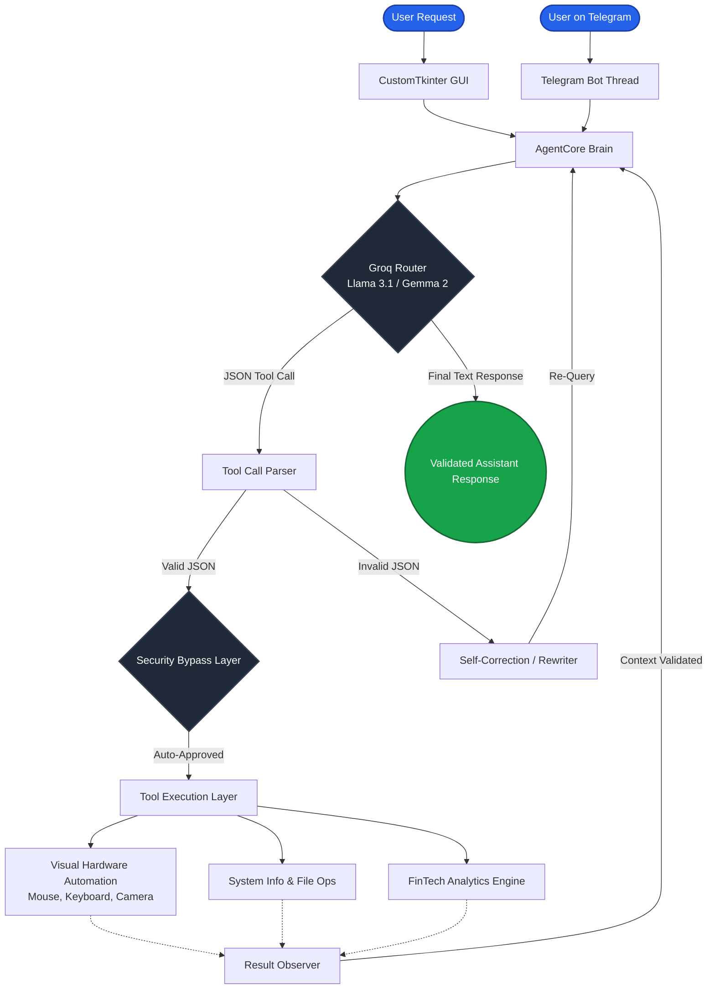

# Intelligent Windows Automation Agent - FinTech Edition

This project is a sophisticated Windows Automation Agent built for a university FinTech assignment. It leverages a Large Language Model (via Groq API) to control the Windows operating system through natural language. 

The agent has evolved from a basic CLI tool into a **fully integrated suite** featuring an elegant graphical user interface, Telegram remote control, hardware automation (mouse/keyboard), and text-to-speech capabilities.

## 🌟 Key Features

- **Integrated Interfaces**:
  - **Elegant GUI**: A sleek, dark-themed CustomTkinter desktop application.
  - **Telegram Bot**: Full remote control over your PC directly from your smartphone.
- **Visual Hardware Automation**: 
  - Watch the agent physically move your mouse and type on your keyboard to demonstrate actions (e.g., visually searching the web or typing notes).
  - Can take photos using your webcam and record audio using your microphone.
- **Voice Interactions**: Speaks to you using the Windows text-to-speech engine.
- **FinTech Scenario (Personal Finance Agent)**: Monitor spending categories, generate CSV files, summarize transactions, and alert budget overruns.
- **ReAct Intelligence Loop**: Uses Reason-Act-Observe loops with LLM tool calling, with fallback fault tolerance to handle rate limits and decommissioned models.

## ⚙️ Prerequisites

- Python 3.10+
- Git
- Windows 10 / 11
- A Telegram account (for bot remote control)
- A Groq API Key (Free tier)

## 🚀 Setup Instructions

1. **Clone the repository:**
   ```powershell
   git clone https://github.com/khelanaramadhan-max/WINDOWS-AI-AGENT-SYSTEM.git
   cd "WINDOWS AI AGENT SYSTEM"
   ```

2. **Set up a Virtual Environment & Install Dependencies:**
   ```powershell
   python -m venv venv
   .\venv\Scripts\activate
   pip install -r requirements.txt
   ```

3. **Configure Environment Variables:**
   - Rename `.env.example` to `.env`.
   - Update the `.env` file with your **Groq API Key** and your **Telegram Bot Token**:
     ```env
     GROQ_API_KEY=your_groq_api_key_here
     TELEGRAM_BOT_TOKEN=your_telegram_bot_token_here
     ```
   *(To get a Telegram token, message `@BotFather` on Telegram and use `/newbot`)*

## 💻 Usage

Start the integrated agent system:
```powershell
.\Start_Agent.bat
```
This single click will:
1. Open the **Elegant GUI** window on your desktop.
2. Initialize the Voice Module to greet you.
3. Silently boot up the **Telegram Bot** in a background thread.

You can now type commands directly into the GUI, or send a message to your Telegram bot from your phone—both will control your PC seamlessly!

### Example Commands:
- *"Visually write a note in notepad that says hello world."* (Watch the mouse and keyboard move automatically!)
- *"Open chrome and visually search for a bird picture."*
- *"Take a picture using my webcam."*
- *"Speak out loud and say 'I am alive'."*
- *"Create a sample transactions CSV and summarize my budget."*

## 🧠 Architecture & Process Pipeline

The intelligence agent operates via a self-correcting state machine (ReAct loop). 



